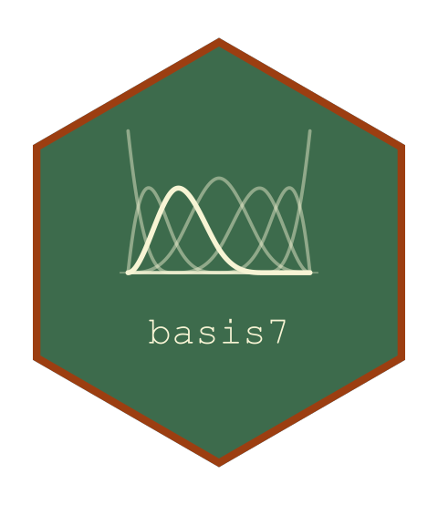

<!-- README.md is generated from README.Rmd. Please edit that file, then
     regenerate with devtools::build_readme(). Do not use knitr::knit(): it
     processes the code but leaves this YAML header in the output as literal
     text, which GitHub and pkgdown both render verbatim. -->

<!-- badges: start -->
[](https://github.com/statmodels7/basis7/actions/workflows/R-CMD-check.yaml)
[](https://app.codecov.io/gh/statmodels7/basis7)
[](https://lifecycle.r-lib.org/articles/stages.html#experimental)
<!-- badges: end -->

```{r, include = FALSE}
knitr::opts_chunk$set(
  collapse = TRUE,
  comment = "#>",
  fig.path = "man/figures/README-",
  out.width = "100%"
)
library(basis7)
```

# basis7 

Every R package that fits smooth terms carries its own basis code, written
inside the routine that needs it and exposing exactly what its author needed.
A cubic B-spline is a fixed mathematical object, and it can be written once
with everything a modelling routine could want already computed.

`{basis7}` makes a basis an object that can be **evaluated, differentiated to
any order, integrated, and asked for its inner products**. The last of these is
what no other basis code carries: the Gram matrix
$G_d = \int B^{(d)} B^{(d)\top}$ is exactly what a roughness penalty
integrates, and here it is exact rather than approximated on a grid.

It is the basis layer of [statmodels7](https://statmodels7.github.io), an S7
toolkit for statistical modelling, alongside
[linkfunctions7](https://statmodels7.github.io/linkfunctions7/),
[distributions7](https://statmodels7.github.io/distributions7/) and
[optimizers7](https://statmodels7.github.io/optimizers7/).

## Installation

```{r eval=FALSE}
# install.packages("pak")
pak::pak("statmodels7/basis7")
```

## A basis is an object

```{r}
b <- bspline_basis(lower = 0, upper = 1, dimension = 6, degree = 3)
b

round(basis_eval(b, c(0, 0.25, 0.5, 1)), 4)
```

The four generics answer in the same shape, so nothing downstream has to know
which family it was given.

```{r}
round(basis_deriv(b, 0.4, order = 2), 3)
round(basis_int(b, 0.4), 4)
```

```{r basis-plot, fig.height = 3.2, fig.width = 9}
par(mfrow = c(1, 3))
plot(b)
plot(b, order = 1)
plot(b, order = -1)
```

## The integral is anchored

Its value at the lower endpoint is exactly zero, for every basis. Any
antiderivative would satisfy a differentiation check, so leaving the constant
free would let two bases disagree while both looked right.

```{r}
basis_int(fourier_basis(lower = -1, upper = 3, dimension = 5), -1)
```

## Inner products, exactly

On each knot interval the integrand of the Gram matrix is a polynomial of known
degree, so a Gauss-Legendre rule sized from that degree leaves no quadrature
error. For a Fourier basis over a whole period the matrix is diagonal in closed
form.

```{r}
round(basis_gram(b, order = 2), 2)
round(basis_gram(fourier_basis(dimension = 5), order = 1), 4)
```

The point of the matrix is that $\beta^\top G_d \beta$ is the integral of the
squared $d$-th derivative of the function the coefficients describe:

```{r}
set.seed(1)
beta <- rnorm(6)
f2 <- function(t) (basis_deriv(b, t, order = 2) %*% beta)^2

c(
  quadratic_form = drop(t(beta) %*% basis_gram(b, order = 2) %*% beta),
  integral = integrate(function(t) apply(cbind(t), 1, f2), 0, 1)$value
)
```

## A user-defined basis needs only its evaluation

Everything else has a numerical method registered on the base class, so a new
basis is a subclass and one method. Derivatives use a single finite-difference
stencil, never a chain of first differences.

```{r}
Bumps <- S7::new_class("Bumps", parent = basis)

S7::method(basis_eval, Bumps) <- function(basis, x, ...) {
  out <- exp(-0.5 * outer(x, basis@basis_params$centres, "-")^2 / 0.15^2)
  colnames(out) <- basis_colnames(basis)
  out
}

bumps <- Bumps(
  basis_name = "bumps", dimension = 5L, lower = 0, upper = 1,
  basis_params = list(centres = seq(0.1, 0.9, length.out = 5))
)

# never implemented, yet available
round(basis_deriv(bumps, 0.5, order = 1), 4)
round(basis_int(bumps, 1), 4)
```

## Validating a basis

`check_basis()` runs six numerical checks: the shapes and column names, the
derivatives against finite differences, the integral differentiating back and
vanishing at the lower endpoint, the partition of unity where the family claims
it, the Gram matrix against an independent quadrature, and missing values
travelling through.

A quantity that came from a fallback is reported as **unchecked**, not as
passed. Comparing it with a numerical reference would be the same arithmetic
twice, agreeing however wrong the basis is.

```{r}
invisible(check_basis(b))
invisible(check_basis(bumps))
```

## What is in the box

| | |
|---|---|
| families | `bspline_basis()`, `fourier_basis()` |
| generics | `basis_eval()`, `basis_deriv()`, `basis_int()`, `basis_gram()`, `basis_colnames()` |
| tools | `check_basis()`, `basis_is_numerical()`, `print()`, `plot()` |

## Related

- [linkfunctions7](https://statmodels7.github.io/linkfunctions7/) — link
  functions with exact derivatives to fourth order
- [distributions7](https://statmodels7.github.io/distributions7/) —
  distributions carrying exact derivatives of the log-likelihood
- [optimizers7](https://statmodels7.github.io/optimizers7/) — optimisation
  algorithms and stopping rules as objects
- [the book](https://statmodels7.github.io/book/) — the mathematics behind
  the toolkit
