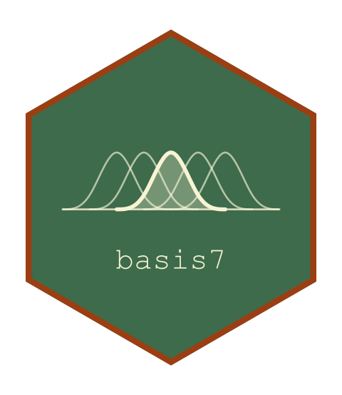

<!-- README.md is generated from README.Rmd. Please edit that file, then
     regenerate with devtools::build_readme(). Do not use knitr::knit(): it
     processes the code but leaves this YAML header in the output as literal
     text, which GitHub and pkgdown both render verbatim. -->

<!-- badges: start -->
[](https://github.com/statmodels7/basis7/actions/workflows/R-CMD-check.yaml)
[](https://app.codecov.io/gh/statmodels7/basis7)
[](https://lifecycle.r-lib.org/articles/stages.html#experimental)
<!-- badges: end -->

```{r, include = FALSE}
knitr::opts_chunk$set(
  collapse = TRUE,
  comment = "#>",
  fig.path = "man/figures/README-",
  out.width = "100%"
)
library(basis7)
```

# basis7 

Many R packages that fit smooth terms carry their own basis code, written
inside the routine that needs it and providing only what its author needed.
A cubic B-spline is a fixed mathematical object, and it can be written once
with the quantities a modeling routine needs already computed.

`{basis7}` makes a basis an object that can be **evaluated, differentiated to
any order, integrated, and used to compute its inner products**. The last of
these is the Gram matrix $G_d = \int B^{(d)} B^{(d)\top}$, the matrix that a
roughness penalty integrates; for the shipped families it is computed exactly,
in closed form or by a quadrature that is exact for the integrand. On top of
the bases the package builds smoothers, which pair a basis with a penalty
given by a linear differential operator.

It is the basis layer of [statmodels7](https://statmodels7.github.io), an S7
toolkit for statistical modeling, alongside
[linkfunctions7](https://statmodels7.github.io/linkfunctions7/),
[distributions7](https://statmodels7.github.io/distributions7/) and
[optimizers7](https://statmodels7.github.io/optimizers7/).

## Installation

```{r eval=FALSE}
# install.packages("pak")
pak::pak("statmodels7/basis7")
```

Or the whole toolkit at once, which also installs the other packages of
the toolkit:

```{r eval=FALSE}
pak::pak("statmodels7/statmodels7")
```

## A basis is an object

```{r}
b <- bspline_basis(lower = 0, upper = 1, dimension = 6, degree = 3)
b

round(basis_eval(b, c(0, 0.25, 0.5, 1)), 4)
```

`basis_eval()`, `basis_deriv()` and `basis_int()` return a matrix with one
row per point and one column per function, with the same column names for
every family, so code that uses a basis does not depend on its family.
`basis_gram()` returns a square matrix with one row and one column per
function.

```{r}
round(basis_deriv(b, 0.4, order = 2), 3)
round(basis_int(b, 0.4), 4)
```

```{r basis-plot, fig.height = 3.2, fig.width = 9}
par(mfrow = c(1, 3))
plot(b)
plot(b, order = 1)
plot(b, order = -1)
```

## The integral is anchored

Its value at the lower endpoint is exactly zero, for every basis. Any
antiderivative would satisfy a differentiation check, so with the constant
left free two bases could disagree while both looked correct.

```{r}
basis_int(fourier_basis(lower = -1, upper = 3, dimension = 5), -1)
```

## Inner products, exactly

On each knot interval the integrand of the Gram matrix of a B-spline is a
polynomial of known degree, so a Gauss-Legendre rule sized from that degree
leaves no quadrature error. For a Fourier basis over a whole period the matrix is diagonal in closed
form.

```{r}
round(basis_gram(b, order = 2), 2)
round(basis_gram(fourier_basis(dimension = 5), order = 1), 4)
```

The quadratic form $\beta^\top G_d \beta$ is the integral of the squared
$d$-th derivative of the function described by the coefficients:

```{r}
set.seed(1)
beta <- rnorm(6)
f2 <- function(t) (basis_deriv(b, t, order = 2) %*% beta)^2

c(
  quadratic_form = drop(t(beta) %*% basis_gram(b, order = 2) %*% beta),
  integral = integrate(function(t) apply(cbind(t), 1, f2), 0, 1)$value
)
```

## Every transform of a basis is one linear map

Orthonormalization, an identifiability constraint and the Demmler-Reinsch
construction are the same operation, $B \mapsto BT$, so they share one class.
Derivatives and integrals transform by the same $T$, and the Gram matrix by
congruence, so a parent with an exact Gram matrix passes its exactness on.

```{r}
o <- orthonorm_basis(b)
round(basis_gram(o), 12)[1:4, 1:4]
```

`dr_basis()` builds the basis that diagonalizes the empirical inner product
and the penalty at once, and is empirically orthogonal to a constant and to
the covariate. It factorizes the penalty and not the design, so it works on
a design that has lost rank, which equally spaced knots produce when the data
leave `degree + 1` or more consecutive knot spans empty:

```{r}
x <- sort(c(seq(0, 0.25, length.out = 120), seq(0.78, 1, length.out = 120)))
wide <- bspline_basis(dimension = 14)

c(dimension = wide@dimension, rank = qr(basis_eval(wide, x))$rank)

d <- dr_basis(wide, x)
z <- basis_eval(d, x)
c(
  off_diagonal = max(abs(crossprod(z)[upper.tri(crossprod(z))])),
  orthogonal_to_1_and_x = max(abs(crossprod(cbind(1, x), z)))
)
```

## Several variables, without building the product

`tensor_basis()` multiplies bases, one per variable. The product separates, so
the Gram matrix is the Kronecker product of the marginal ones and is exact
at any number of variables:

```{r}
t2 <- tensor_basis(bspline_basis(dimension = 4), fourier_basis(dimension = 3))
t2

max(abs(basis_gram(t2) - kronecker(
  basis_gram(bspline_basis(dimension = 4)),
  basis_gram(fourier_basis(dimension = 3))
)))
```

The design matrix, on the other hand, grows as the product of the marginal
dimensions, which makes interactions expensive. `basis_contract()` computes
the values described by the coefficients from the marginal evaluations alone.
Given the coefficients as factor matrices, the cost is linear in the number
of variables instead of exponential:

```{r}
big <- tensor_basis(rep(list(bspline_basis(dimension = 10)), 6))
big@dimension # the design matrix would have this many columns

set.seed(2)
x <- matrix(runif(1000 * 6), 1000, 6)
gamma <- replicate(6, matrix(rnorm(10 * 4), 10, 4), simplify = FALSE)

head(basis_contract(big, x, gamma), 3)
```

## A user-defined basis needs only its evaluation

Every other generic has a numerical method registered on the base class, so
a new basis is a subclass and one method. Derivatives use a single
finite-difference stencil, never a chain of first differences.

```{r}
Bumps <- S7::new_class("Bumps", parent = basis)

S7::method(basis_eval, Bumps) <- function(basis, x, ...) {
  out <- exp(-0.5 * outer(x, basis@basis_params$centers, "-")^2 / 0.15^2)
  colnames(out) <- basis_colnames(basis)
  out
}

bumps <- Bumps(
  basis_name = "bumps", dimension = 5L, lower = 0, upper = 1,
  basis_params = list(centers = seq(0.1, 0.9, length.out = 5))
)

# not implemented by the class, and available
round(basis_deriv(bumps, 0.5, order = 1), 4)
round(basis_int(bumps, 1), 4)
```

## Validating a basis

`check_basis()` runs six numerical checks: the shapes and column names, the
derivatives against finite differences, the integral differentiating back and
vanishing at the lower endpoint, the partition of unity where the family claims
it, the Gram matrix against an independent quadrature, and missing values
traveling through.

For a derivative or an integral that came from a fallback the check is not
run and the row prints `[numerical]`, because comparing it with a numerical
reference would repeat the same arithmetic. For a Gram matrix that came from a
fallback only its symmetry and positive semidefiniteness are tested.

```{r}
invisible(check_basis(b))
invisible(check_basis(bumps))
```

## Contents

| | |
|---|---|
| families | `bspline_basis()`, `fourier_basis()`, `poly_basis()` |
| several variables | `tensor_basis()`, `basis_contract()`, `basis_nvar()` |
| generics | `basis_eval()`, `basis_deriv()`, `basis_int()`, `basis_gram()`, `basis_colnames()` |
| transforms | `orthonorm_basis()`, `constrain_basis()`, `dr_basis()` |
| smoothers | `bspline_smooth()`, `pspline_smooth()`, `fourier_smooth()`, `legendre_smooth()`, `cyclic_smooth()`, `adaptive_smooth()`, `smoother_build()`, `smoother_apply()` |
| operators | `deriv_operator()`, `harmonic_operator()`, `oscillator_operator()`, `linear_operator()`, `operator_null()` |
| tools | `check_basis()`, `basis_is_numerical()`, `print()`, `plot()` |

## Related

- [linkfunctions7](https://statmodels7.github.io/linkfunctions7/): link
  functions with exact derivatives to fifth order
- [distributions7](https://statmodels7.github.io/distributions7/):
  distributions with exact derivatives of the log-likelihood
- [optimizers7](https://statmodels7.github.io/optimizers7/): optimization
  algorithms and stopping rules as objects
- [the book](https://statmodels7.github.io/book/): the mathematics of the
  toolkit
