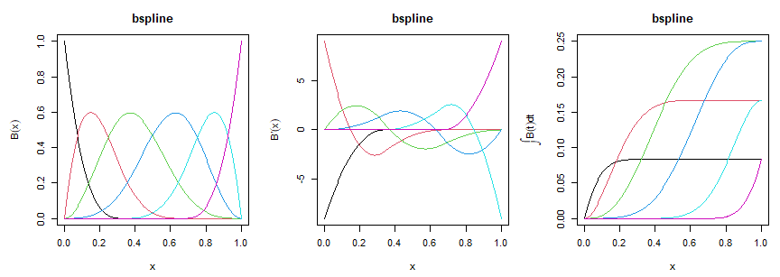

<!-- README.md is generated from README.Rmd. Please edit that file, then
     regenerate with devtools::build_readme(). Do not use knitr::knit(): it
     processes the code but leaves this YAML header in the output as literal
     text, which GitHub and pkgdown both render verbatim. -->

<!-- badges: start -->

[](https://github.com/statmodels7/basis7/actions/workflows/R-CMD-check.yaml)
[](https://app.codecov.io/gh/statmodels7/basis7)
[](https://lifecycle.r-lib.org/articles/stages.html#experimental)
<!-- badges: end -->

# basis7 

Every R package that fits smooth terms carries its own basis code,
written inside the routine that needs it and exposing exactly what its
author needed. A cubic B-spline is a fixed mathematical object, and it
can be written once with everything a modeling routine could want
already computed.

`{basis7}` makes a basis an object that can be **evaluated,
differentiated to any order, integrated, and asked for its inner
products**. The last of these is what no other basis code carries: the
Gram matrix $G_d = \int B^{(d)} B^{(d)\top}$ is exactly what a roughness
penalty integrates, and here it is exact rather than approximated on a
grid.

It is the basis layer of [statmodels7](https://statmodels7.github.io),
an S7 toolkit for statistical modeling, alongside
[linkfunctions7](https://statmodels7.github.io/linkfunctions7/),
[distributions7](https://statmodels7.github.io/distributions7/) and
[optimizers7](https://statmodels7.github.io/optimizers7/).

## Installation

``` r
# install.packages("pak")
pak::pak("statmodels7/basis7")
```

Or the whole toolkit at once, which also installs the six sibling
packages:

``` r
pak::pak("statmodels7/statmodels7")
```

## A basis is an object

``` r
b <- bspline_basis(lower = 0, upper = 1, dimension = 6, degree = 3)
b
#> Basis: bspline
#> Functions: 6   Variables: 1
#> Domain: [0, 1]
#> Parameters:
#>   degree          3
#>   knots           0.3333, 0.6667
#>   boundary_knots  0, 1
#> Numerical: none

round(basis_eval(b, c(0, 0.25, 0.5, 1)), 4)
#>         bs1    bs2    bs3    bs4    bs5 bs6
#> [1,] 1.0000 0.0000 0.0000 0.0000 0.0000   0
#> [2,] 0.0156 0.4570 0.4570 0.0703 0.0000   0
#> [3,] 0.0000 0.0312 0.4687 0.4687 0.0312   0
#> [4,] 0.0000 0.0000 0.0000 0.0000 0.0000   1
```

The four generics answer in the same shape, so nothing downstream has to
know which family it was given.

``` r
round(basis_deriv(b, 0.4, order = 2), 3)
#>      bs1  bs2   bs3 bs4 bs5 bs6
#> [1,]   0 10.8 -16.2 2.7 2.7   0
round(basis_int(b, 0.4), 4)
#>         bs1    bs2    bs3    bs4 bs5 bs6
#> [1,] 0.0833 0.1581 0.1298 0.0287   0   0
```

``` r
par(mfrow = c(1, 3))
plot(b)
plot(b, order = 1)
plot(b, order = -1)
```



## The integral is anchored

Its value at the lower endpoint is exactly zero, for every basis. Any
antiderivative would satisfy a differentiation check, so leaving the
constant free would let two bases disagree while both looked right.

``` r
basis_int(fourier_basis(lower = -1, upper = 3, dimension = 5), -1)
#>      const sin1 cos1 sin2 cos2
#> [1,]     0    0    0    0    0
```

## Inner products, exactly

On each knot interval the integrand of the Gram matrix is a polynomial
of known degree, so a Gauss-Legendre rule sized from that degree leaves
no quadrature error. For a Fourier basis over a whole period the matrix
is diagonal in closed form.

``` r
round(basis_gram(b, order = 2), 2)
#>        bs1     bs2     bs3     bs4     bs5    bs6
#> bs1  324.0 -445.50   94.50   27.00    0.00    0.0
#> bs2 -445.5  648.00 -182.25  -30.37   10.12    0.0
#> bs3   94.5 -182.25  121.50  -30.38  -30.37   27.0
#> bs4   27.0  -30.37  -30.38  121.50 -182.25   94.5
#> bs5    0.0   10.12  -30.37 -182.25  648.00 -445.5
#> bs6    0.0    0.00   27.00   94.50 -445.50  324.0
round(basis_gram(fourier_basis(dimension = 5), order = 1), 4)
#>       const    sin1    cos1    sin2    cos2
#> const     0  0.0000  0.0000  0.0000  0.0000
#> sin1      0 19.7392  0.0000  0.0000  0.0000
#> cos1      0  0.0000 19.7392  0.0000  0.0000
#> sin2      0  0.0000  0.0000 78.9568  0.0000
#> cos2      0  0.0000  0.0000  0.0000 78.9568
```

The point of the matrix is that $\beta^\top G_d \beta$ is the integral
of the squared $d$-th derivative of the function the coefficients
describe:

``` r
set.seed(1)
beta <- rnorm(6)
f2 <- function(t) (basis_deriv(b, t, order = 2) %*% beta)^2

c(
  quadratic_form = drop(t(beta) %*% basis_gram(b, order = 2) %*% beta),
  integral = integrate(function(t) apply(cbind(t), 1, f2), 0, 1)$value
)
#> quadratic_form       integral 
#>       954.9932       954.9932
```

## Every transform of a basis is one linear map

Orthonormalization, an identifiability constraint and the
Demmler-Reinsch construction are the same operation, $B \mapsto BT$, so
they share one class. Derivatives and integrals transform by the same
$T$, and the Gram matrix by congruence, so a parent with an exact Gram
matrix passes its exactness on.

``` r
o <- orthonorm_basis(b)
round(basis_gram(o), 12)[1:4, 1:4]
#>     on1 on2 on3 on4
#> on1   1   0   0   0
#> on2   0   1   0   0
#> on3   0   0   1   0
#> on4   0   0   0   1
```

`dr_basis()` builds the basis that diagonalizes the empirical inner
product and the penalty at once, and is empirically orthogonal to a
constant and to the covariate. It factorizes the penalty and not the
design, so it survives a design that has lost rank, which equally spaced
knots produce whenever the data leave a knot span empty:

``` r
x <- sort(c(seq(0, 0.25, length.out = 120), seq(0.78, 1, length.out = 120)))
wide <- bspline_basis(dimension = 14)

c(dimension = wide@dimension, rank = qr(basis_eval(wide, x))$rank)
#> dimension      rank 
#>        14        12

d <- dr_basis(wide, x)
z <- basis_eval(d, x)
c(
  off_diagonal = max(abs(crossprod(z)[upper.tri(crossprod(z))])),
  orthogonal_to_1_and_x = max(abs(crossprod(cbind(1, x), z)))
)
#>          off_diagonal orthogonal_to_1_and_x 
#>          3.108624e-14          7.571721e-14
```

## Several variables, without building the product

`tensor_basis()` multiplies bases, one per variable. The product
separates, so the Gram matrix is the Kronecker product of the marginal
ones and stays exact however many variables there are:

``` r
t2 <- tensor_basis(bspline_basis(dimension = 4), fourier_basis(dimension = 3))
t2
#> Basis: tensor(bspline, fourier)
#> Functions: 12   Variables: 2
#> Domain: [0, 1] x [0, 1]
#> Parameters:
#>   marginal_dimensions  4, 3
#> Numerical: none

max(abs(basis_gram(t2) - kronecker(
  basis_gram(bspline_basis(dimension = 4)),
  basis_gram(fourier_basis(dimension = 3))
)))
#> [1] 0
```

The design matrix, on the other hand, grows as the product of the
marginal dimensions, and that is what makes interactions expensive.
`basis_contract()` computes the values the coefficients describe from
the marginal evaluations alone. Given the coefficients as factor
matrices, the cost is linear in the number of variables rather than
exponential in it:

``` r
big <- tensor_basis(rep(list(bspline_basis(dimension = 10)), 6))
big@dimension # the design matrix would have this many columns
#> [1] 1000000

set.seed(2)
x <- matrix(runif(1000 * 6), 1000, 6)
gamma <- replicate(6, matrix(rnorm(10 * 4), 10, 4), simplify = FALSE)

head(basis_contract(big, x, gamma), 3)
#> [1] 0.001117661 0.066648067 0.003906074
```

## A user-defined basis needs only its evaluation

Everything else has a numerical method registered on the base class, so
a new basis is a subclass and one method. Derivatives use a single
finite-difference stencil, never a chain of first differences.

``` r
Bumps <- S7::new_class("Bumps", parent = basis)

S7::method(basis_eval, Bumps) <- function(basis, x, ...) {
  out <- exp(-0.5 * outer(x, basis@basis_params$centers, "-")^2 / 0.15^2)
  colnames(out) <- basis_colnames(basis)
  out
}

bumps <- Bumps(
  basis_name = "bumps", dimension = 5L, lower = 0, upper = 1,
  basis_params = list(centers = seq(0.1, 0.9, length.out = 5))
)

# never implemented, yet available
round(basis_deriv(bumps, 0.5, order = 1), 4)
#>          bu1     bu2 bu3    bu4    bu5
#> [1,] -0.5078 -3.6543   0 3.6543 0.5078
round(basis_int(bumps, 1), 4)
#>         bu1    bu2    bu3    bu4    bu5
#> [1,] 0.2811 0.3674 0.3757 0.3674 0.2811
```

## Validating a basis

`check_basis()` runs six numerical checks: the shapes and column names,
the derivatives against finite differences, the integral differentiating
back and vanishing at the lower endpoint, the partition of unity where
the family claims it, the Gram matrix against an independent quadrature,
and missing values traveling through.

A quantity that came from a fallback is reported as **unchecked**, not
as passed. Comparing it with a numerical reference would be the same
arithmetic twice, agreeing however wrong the basis is.

``` r
invisible(check_basis(b))
#> check_basis: bspline (6 functions)
#>   shape       shapes and column names                        [PASSED]
#>   deriv       derivatives against finite differences         [PASSED]
#>   integral    integral differentiates back, zero at lower    [PASSED]
#>   partition   partition of unity                             [PASSED]
#>   gram        Gram symmetric, PSD, matches quadrature        [PASSED]
#>   missing     missing values give missing rows               [PASSED]
invisible(check_basis(bumps))
#> check_basis: bumps (5 functions)
#>   shape       shapes and column names                        [PASSED]
#>   deriv       derivatives against finite differences         [numerical]
#>   integral    integral differentiates back, zero at lower    [numerical]
#>   partition   partition of unity                             [not claimed]
#>   gram        Gram symmetric, PSD, matches quadrature        [PASSED]
#>   missing     missing values give missing rows               [PASSED]
#>   computed numerically: basis_deriv, basis_int, basis_gram
```

## What is in the box

|  |  |
|----|----|
| families | `bspline_basis()`, `fourier_basis()`, `poly_basis()` |
| several variables | `tensor_basis()`, `basis_contract()`, `basis_nvar()` |
| generics | `basis_eval()`, `basis_deriv()`, `basis_int()`, `basis_gram()`, `basis_colnames()` |
| transforms | `orthonorm_basis()`, `constrain_basis()`, `dr_basis()` |
| tools | `check_basis()`, `basis_is_numerical()`, `print()`, `plot()` |

## Related

- [linkfunctions7](https://statmodels7.github.io/linkfunctions7/) — link
  functions with exact derivatives to fourth order
- [distributions7](https://statmodels7.github.io/distributions7/) —
  distributions carrying exact derivatives of the log-likelihood
- [optimizers7](https://statmodels7.github.io/optimizers7/) —
  optimization algorithms and stopping rules as objects
- [the book](https://statmodels7.github.io/book/) — the mathematics
  behind the toolkit
