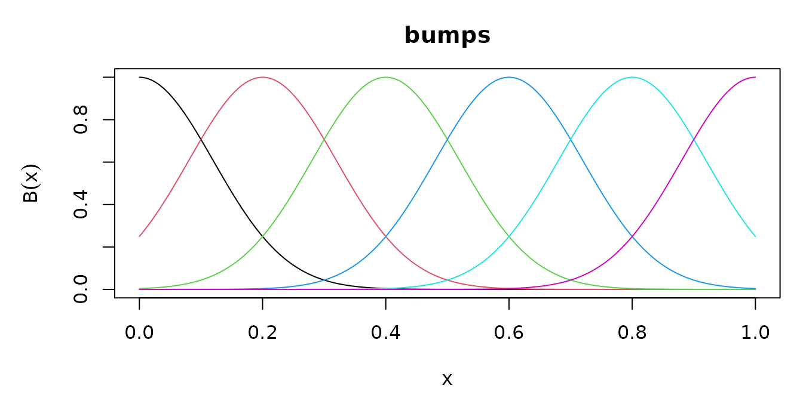

# Defining a basis

A basis that only worked for the three families the package ships would
have solved nothing. This vignette adds one the package does not ship,
and shows what the package guarantees about it at each step.

## The minimum

A new basis is a subclass of `basis` and a method for
[`basis_eval()`](https://statmodels7.github.io/basis7/reference/basis_eval.md).
Nothing else is required.

Take a basis of Gaussian bumps, $`\exp\{-(x - c_j)^2 / 2s^2\}`$ at
equally spaced centers $`c_j`$. They are not orthogonal, not a partition
of unity, and have no compact support, so nothing about them is
inherited from the families already here.

``` r

Bumps <- S7::new_class("Bumps", parent = basis)

S7::method(basis_eval, Bumps) <- function(basis, x, ...) {
  p <- basis@basis_params
  out <- exp(-0.5 * outer(x, p$centers, "-")^2 / p$width^2)
  colnames(out) <- basis_colnames(basis)
  out
}

bumps <- function(lower = 0, upper = 1, dimension = 6, width = 0.12) {
  Bumps(
    basis_name = "bumps",
    dimension = as.integer(dimension),
    lower = lower, upper = upper,
    basis_params = list(
      centers = seq(lower, upper, length.out = dimension),
      width = width
    )
  )
}

b <- bumps()
b
#> Basis: bumps
#> Functions: 6   Variables: 1
#> Domain: [0, 1]
#> Parameters:
#>   centers  <6 values>
#>   width    0.12
#> Numerical: basis_deriv, basis_int, basis_gram
```

The object already answers all four generics.

``` r

round(basis_deriv(b, 0.5, order = 1), 4)
#>          bu1     bu2     bu3    bu4    bu5    bu6
#> [1,] -0.0059 -0.9154 -4.9073 4.9073 0.9154 0.0059
round(basis_int(b, 1), 4)
#>         bu1    bu2    bu3    bu4    bu5    bu6
#> [1,] 0.1504 0.2864 0.3007 0.3007 0.2864 0.1504
round(basis_gram(b)[1:3, 1:3], 4)
#>        bu1    bu2    bu3
#> bu1 0.1063 0.0935 0.0131
#> bu2 0.0935 0.2107 0.1062
#> bu3 0.0131 0.1062 0.2127
```

``` r

plot(b)
```



Two conventions the method has to keep. The column names come from
[`basis_colnames()`](https://statmodels7.github.io/basis7/reference/basis_colnames.md)
rather than being written out, so that evaluation, derivatives and
integrals always agree on them. And a missing evaluation point must give
a missing row: here [`outer()`](https://rdrr.io/r/base/outer.html)
propagates it for free, which is worth checking rather than assuming.

## What the fallbacks are, and what they are not

The three derived generics have numerical methods registered on the
`basis` class. The object says which ones it is using:

``` r

basis_is_numerical(b)
#> basis_deriv   basis_int  basis_gram 
#>        TRUE        TRUE        TRUE
```

The derivatives are one central-difference stencil, built from a
Vandermonde solve and applied in a single step. That is not the same as
composing first differences: each numerical differentiation multiplies
the error of the one before it, so a third derivative reached by three
nested first differences is noise. Near the interval endpoints the
stencil becomes one-sided, because a symmetric one would ask for points
outside the interval where the basis is not defined.

``` r

# the closed form, for comparison: d/dx exp(-(x-c)^2/2s^2) = -(x-c)/s^2 * f
x <- seq(0, 1, length.out = 5)
exact <- -outer(x, b@basis_params$centers, "-") / b@basis_params$width^2 *
  basis_eval(b, x)

max(abs(basis_deriv(b, x, order = 1) - exact))
#> [1] 4.801691e-09
```

The integral is anchored: its value at the lower endpoint is exactly
zero, for every basis. Any antiderivative satisfies a differentiation
check, so leaving the constant free would let two bases disagree while
both looked right, and a sum of them would be wrong with nothing to
report it.

``` r

basis_int(b, b@lower)
#>      bu1 bu2 bu3 bu4 bu5 bu6
#> [1,]   0   0   0   0   0   0
```

## Adding a closed form

A closed form registered later takes over through dispatch, with no
change to calling code. Here is the derivative, which is one line for
this family:

``` r

S7::method(basis_deriv, Bumps) <- function(basis, x, order = 1L, ...) {
  p <- basis@basis_params
  z <- outer(x, p$centers, "-") / p$width
  # Hermite: the d-th derivative of a Gaussian is He_d(-z) / width^d times it
  he <- switch(order + 1L,
    1, -z, z^2 - 1, -z^3 + 3 * z,
    stop("order above three not derived here", call. = FALSE)
  )
  out <- he / p$width^order * basis_eval(basis, x)
  colnames(out) <- basis_colnames(basis)
  out
}

basis_is_numerical(b)
#> basis_deriv   basis_int  basis_gram 
#>       FALSE        TRUE        TRUE
```

Only that one generic changed; the integral and the Gram matrix are
still computed numerically, and the object says so.

## Validating it

[`check_basis()`](https://statmodels7.github.io/basis7/reference/check_basis.md)
runs six numerical checks. It reports a quantity that came from a
fallback as **unchecked** rather than as passed: comparing a finite
difference against a finite difference would be the same arithmetic
twice, agreeing however wrong the basis is.

``` r

invisible(check_basis(b))
#> check_basis: bumps (6 functions)
#>   shape       shapes and column names                        [PASSED]
#>   deriv       derivatives against finite differences         [PASSED]
#>   integral    integral differentiates back, zero at lower    [numerical]
#>   partition   partition of unity                             [not claimed]
#>   gram        Gram symmetric, PSD, matches quadrature        [PASSED]
#>   missing     missing values give missing rows               [PASSED]
#>   computed numerically: basis_int, basis_gram
```

The derivative row is now checked, because the family supplies its own
method, while the integral row is not, because it does not.

The check allows for the accuracy of its own reference. Each reference
is computed at a step and at half of it, and the gap between them bounds
its uncertainty; the comparison is given that much slack, point by
point. Without it, a spline would fail at its own knots, where the third
derivative jumps and a central difference returns the jump rather than
the truncation error.

That allowance has to excuse the reference and nothing else, so it is
worth confirming that a wrong derivative still fails:

``` r

Wrong <- S7::new_class("Wrong", parent = Bumps)
S7::method(basis_deriv, Wrong) <- function(basis, x, order = 1L, ...) {
  1.05 * S7::method(basis_deriv, Bumps)(basis, x, order = order)
}

wrong <- Wrong(
  basis_name = "wrong", dimension = b@dimension, lower = b@lower,
  upper = b@upper, basis_params = b@basis_params
)
check_basis(wrong, verbose = FALSE)[["deriv"]]
#> [1] FALSE
```

## Inner products

[`basis_gram()`](https://statmodels7.github.io/basis7/reference/basis_gram.md)
returns $`\int B^{(d)} B^{(d)\top}`$, which is what a roughness penalty
integrates: $`\beta^\top G_d \beta`$ is the integral of the squared
$`d`$-th derivative of the function the coefficients describe.

``` r

beta <- rnorm(b@dimension)
f2 <- function(t) (basis_deriv(b, t, order = 2) %*% beta)^2

c(
  quadratic_form = drop(t(beta) %*% basis_gram(b, order = 2) %*% beta),
  integral = integrate(function(t) apply(cbind(t), 1, f2), 0, 1)$value
)
#> quadratic_form       integral 
#>       4034.599       4034.599
```

The measure is an argument. The default is Lebesgue on the interval;
`at` takes the empirical measure of a sample, which is the matrix a
design matrix produces, and `weight` takes a weighted integral.

``` r

xs <- runif(2000)
round(basis_gram(b, at = xs)[1:3, 1:3], 4)
#>        bu1    bu2    bu3
#> bu1 0.1125 0.0983 0.0132
#> bu2 0.0983 0.2118 0.1067
#> bu3 0.0132 0.1067 0.2227
```

Both are handled in the body of the generic, before dispatch, so a
method never sees them. A method must still name them in its signature,
because S7 requires a method’s formals to contain the generic’s:

``` r

S7::method(basis_gram, Bumps) <- function(basis, order = 0L, at = NULL,
                                          weight = NULL, ...) {
  # a closed form would go here; this one just tightens the quadrature
  basis7:::numerical_gram(basis, order, panels = 200L, nodes = 12L)
}
basis_is_numerical(b)
#> basis_deriv   basis_int  basis_gram 
#>       FALSE        TRUE       FALSE
```

## Transforming it

Orthonormalization, an identifiability constraint and the
Demmler-Reinsch construction are the same operation, $`B \mapsto BT`$,
so they share one class. Derivatives and integrals transform by the same
$`T`$, and the Gram matrix by congruence, so a parent with an exact Gram
matrix passes its exactness on.

``` r

o <- orthonorm_basis(b)
round(basis_gram(o), 10)[1:4, 1:4]
#>     on1 on2 on3 on4
#> on1   1   0   0   0
#> on2   0   1   0   0
#> on3   0   0   1   0
#> on4   0   0   0   1
```

A constraint reduces the dimension by its rank:

``` r

grid <- seq(0, 1, length.out = 200)
cs <- constrain_basis(b, colSums(basis_eval(b, grid)))
c(before = b@dimension, after = cs@dimension)
#> before  after 
#>      6      5
max(abs(colSums(basis_eval(cs, grid))))
#> [1] 5.662137e-15
```

And
[`dr_basis()`](https://statmodels7.github.io/basis7/reference/dr_basis.md)
builds the basis that diagonalizes the empirical inner product and the
penalty at once, and is empirically orthogonal to a constant and to
$`x`$. It works on any basis, this one included:

``` r

xd <- sort(runif(300))
d <- dr_basis(b, xd)

z <- basis_eval(d, xd)
c(
  off_diagonal = max(abs(crossprod(z)[upper.tri(crossprod(z))])),
  orthogonal_to_1_and_x = max(abs(crossprod(cbind(1, xd), z)))
)
#>          off_diagonal orthogonal_to_1_and_x 
#>          1.125910e-13          7.593925e-14
```

Transforms compose by multiplication rather than by nesting, so a chain
of them costs one matrix product per evaluation however long it is:

``` r

S7::S7_inherits(orthonorm_basis(cs)@parent_basis, TransformedBasis)
#> [1] FALSE
```

## Multiplying it

A basis of several variables is a product of bases of one, and any basis
can be a factor, including this one. The result takes a matrix of points
with one column per variable, and the derivative order becomes a
multi-index.

``` r

tb <- tensor_basis(b, bspline_basis(dimension = 5))
c(variables = basis_nvar(tb), functions = tb@dimension)
#> variables functions 
#>         2        30

xy <- cbind(runif(6), runif(6))
dim(basis_deriv(tb, xy, order = c(1, 2)))
#> [1]  6 30
```

Everything about the product follows from the marginals, because the
product separates. The Gram matrix in particular is the Kronecker
product of the marginal ones, so it stays as exact as they are however
many variables there are, where a quadrature over the box would degrade
with every one:

``` r

max(abs(basis_gram(tb) - kronecker(
  basis_gram(b), basis_gram(bspline_basis(dimension = 5))
)))
#> [1] 0
```

What does not stay cheap is the design matrix, whose columns are the
product of the marginal dimensions.
[`basis_contract()`](https://statmodels7.github.io/basis7/reference/basis_contract.md)
computes the values the coefficients describe without forming it.
Coefficients come as an array, whose dimensions line up with the
marginals:

``` r

cf <- array(rnorm(tb@dimension), dim = c(b@dimension, 5))
max(abs(basis_contract(tb, xy, cf) -
  basis_eval(tb, xy) %*% as.numeric(aperm(cf))))
#> [1] 0
```

or as factor matrices, one per marginal with a shared number of columns,
in which case neither the design matrix nor the coefficient array is
ever formed and the cost is linear in the number of variables:

``` r

gam <- list(
  matrix(rnorm(b@dimension * 2), b@dimension, 2),
  matrix(rnorm(5 * 2), 5, 2)
)
head(basis_contract(tb, xy, gam), 3)
#> [1] -0.9356725 -0.6649577 -0.6739005
```

Choosing those factors is a modeling decision, and belongs to the layer
that owns the parameters. Evaluating them is basis arithmetic, and
belongs here.

## Summary

- **Minimum to define a basis:** a subclass of `basis` and a
  [`basis_eval()`](https://statmodels7.github.io/basis7/reference/basis_eval.md)
  method whose columns are named by
  [`basis_colnames()`](https://statmodels7.github.io/basis7/reference/basis_colnames.md).
- From the evaluation alone come the derivatives, the integral and the
  Gram matrix, and
  [`basis_is_numerical()`](https://statmodels7.github.io/basis7/reference/basis_is_numerical.md)
  says which are which.
- Register closed forms one at a time; each takes over through dispatch.
- [`check_basis()`](https://statmodels7.github.io/basis7/reference/check_basis.md)
  verifies what can be verified and reports the rest as unchecked rather
  than as passed.
- Every transform of a basis is one linear map, and it keeps the
  parent’s exactness.
- A product of bases is a basis of several variables; its Gram matrix is
  the Kronecker product of the marginal ones, and
  [`basis_contract()`](https://statmodels7.github.io/basis7/reference/basis_contract.md)
  evaluates it against coefficients without forming the product.
